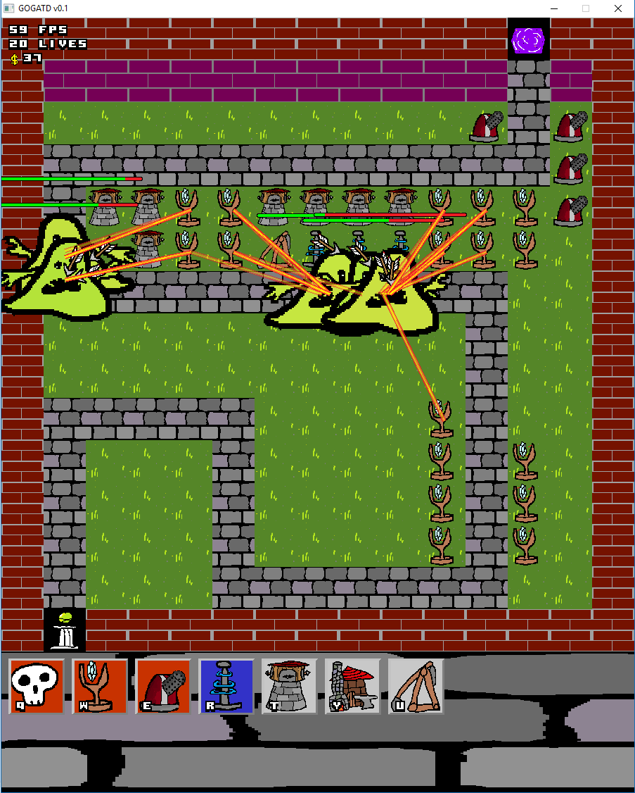

# gogatd

Its a tower defence game written in Go. The enemies evolving by a genetic algorithm is (meant to be) a central mechanic. This was for a November game jam with friends. If I linked you this or you are a random person from the internet, lets do another one sometime soon.

Building will require Go env, probably a C env with sdl2, sdl2-image, sdl2-mix installed.

To build run ```go build```



### Issues
* Might be leaking or fragmenting VRAM, or otherwise messing with GPU state? Not really sure but games crash a lot if I've been working on this.
* Sound hitches (is this an inevitability of Go's GC pauses?)
* Fitness metric of "compare to your neighbours" got broken

### Gameplay TODOS
* More towers
* Active abilities
* Passive abilities
* Status effects (poison, slow, -res, etc)
* Bosses and enemy variability
* Sell towers

### Implementation
Overall approach: simplicity heuristic, use more sophisticated things only as needed/justified. Theres a lot of globals, procs, etc. Its nice not to have to fight with scope. You can define simple procs to draw, update, log, etc. 

#### Asset Management
Requires 1 constant, 1 string (path) and preservation of order but pretty automatic. Fine for the effort required I'd say.

#### Game object defs
Towers are fairly data driven, just defined in an array of structs of the tower types. It was pretty suitable for the task. You can't data drive every ability though, unless there is some cheeky functions being passed around and im worried about overcomplicating that.

#### Game States
Just used a state machine for this, it was pretty dirty but works fine. Events were sort of hacked in here using some state variables. Its possible that a more robust event queue thing would be worthwhile, like something similar to the VFX and maybe sorted with a priority queue.

#### VFX
"Tween" events which are a struct: startTime, stopTime, func(t 0..1)
This enough to implement a lot of visual effects that change over time, like fade/slide in/out, flip for a 2 frame animation, etc. Composes really nicely with slowStart, slowStop curves for desired effect.
This was quite pleasant to work with, though it could maybe be complimented with a "repeat" option for the timing rather than being normalized 0 to 1 for everything. For example, a trebuchet projectile always rotates a fixed number of times in its lifespan (Equivalently, angular velocity varies with distance thrown). 

#### Pathfinding
Just a greedy algorithm since there is just a reall simple path. I chose to have the enemies store only their "distance travelled". Position on the path is determined analytically. This allows for accurate projectile leading, and is more robust to really high speeds and fast forwarding (enemies can't teleport off the path by taking one big step)

#### Genetic Algorithm
The hard part is defining an effective fitness function. There can be a lot of noise, e.g. based on tower placement, going around bends, and there is a definite "transient" phase, when the enemies are bunched up and are pushing a front line forward, and a "steady state" phase where there is a constant stream of enemies.
1. Absolute distance travelled: Effective for steady state but not for transient

2. Relative distance travelled compared to neighbours: Effective for transient but not for steady state

3. Amount of damage resisted for super quick damage resistance education (learns to be a stationary damage sponge though)

I switched to 2, but thinking about it now, its likely that halfway between 1 and 2 is the best. (TODO)

#### Tools etc.
Go is a pleasure to use due to its simplicity. I think I spent less time debugging than not debugging. All of the standard Go tools work great. The GC kind of sucks for my audio (if it is the GC's fault). I avoided using interfaces for this, though. Where unions would have been nice (tower definitions) I just used fat unions (a struct with each option).

SDL is great, its very simple and unintrusive. I would love to have some vector graphics functionality as well. I'm pretty sure its possible to integrate with vector graphics libraries like cairo and Go's image libraries, I was a bit lazy to do so in this project but that will be worth a shot in the future.

#### Assets
Music is "Apero Hour" Kevin MacLeod (incompetech.com)
Licensed under Creative Commons: By Attribution 4.0 License
http://creativecommons.org/licenses/by/4.0/

Many assets from https://opengameart.org

#### Other remarks
I should utilize logs more in the future, with levels and stuff.